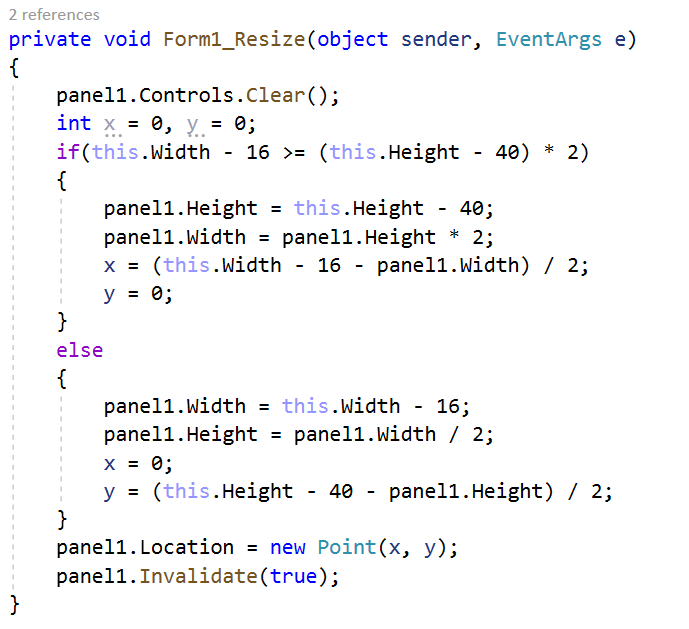

# Avenge the fallen
## Опис на играта
Играта “Avenge the fallen” е налик на играта “Space Invader” произведена од Taito во 1978 година, со таа разлика што во нашата верзија играчот на различните нивоа контролира различен авенџер од Марвел стриповите. Целта во секое ниво е да се погодат 20 непријатели и препреки и да се победи финалниот бос. Во секое ниво се добива еден Infinity Stone, и целта на играта е да се соберат сите такви камења за да се спасат останатите авенџери кои ги нема во играта.

## Упатство за користење
На почетното мени има две дугмиња Play и Quit, при кликање на Play се отвора менито за селектирање ниво, а при кликање на Quit се исклучува играта. На менито за одбирање левел ги има дугмиња за сите левели и дугме за враќање назад кон главното мени – Back. 
Авенџерот можи да се движи на лево и на десно со стрелките на тастатура, а на Space копчето се врши напад (Thor фрла чекан, Iron Man пука ракети и сл.).  
Ако авенџерот е удрен вкупно 3 пати од препрека или непријател или од напад на непријател тогаш се појавува мени Game Over кое има две дугмиња, Start Over кое го ресетира нивото и Quit кое ја исклучува играта.

## Претставување на кодот  и решение на проблемот
Главните податоци и методи се чуваат во класа public class Map, во неа се чува листа на непријатели од класа public class Enemy и листа од препреки public class Obstacle, слика за непријателите на авенџерот и слика за позадина. Тука се чува сликата за непријателите на авенџерот за поефикасно да се додаваат непријателите на мапата (да не се пристапува до главна меморија при секој повик, туку сите непријатели да го користат истиот објект Image). 

Во Map класата има методи за детекција на колизија, помеѓу играчот и непријателите, нападите од непријателите и препреките, и за додавање на нови препреки и непријатели кои се повикуваат од partial class Form1. Исцртувањето се врши на простор со 1000 пиксели ширина и 500 пиксели висина, а потоа со ScaleTransform (e.Graphics.ScaleTransform((float)(panel1.Width / 1000.0F), ((float)(panel1.Height) / 500.0F));) се добива соодветното исцртување врз панелот.

Во partial class Form1 се чуваат објекти од тип public class Avenger, public class  Boss и public class Map и објект од класата Random. Во контролите на формата имаме додадено и објект од класа public class DrawPanel која на следува од Panel. Ни беше потребна класата DrawPanel за во конструкторот да ставиме DoubleBuffered = true; затоа што целото исцртување е на панелот. Во Form1 класата имаме направено и метод кој се повикува при промена на големината на прозорецот кои ја променува и големината на панелот, за да го прави најголем што можи, но и да се прикажува се што се исцртува на него.

Непријателите, препреките и нападите од  непријателите цело време се движат на долу на мапата, а од горната страна се додаваат нови. Додавањето на препреки и непријатели се прави наизменично, и нивната локација се прави со рандом функција која проверува да не се прекопуваат при додавањето.
